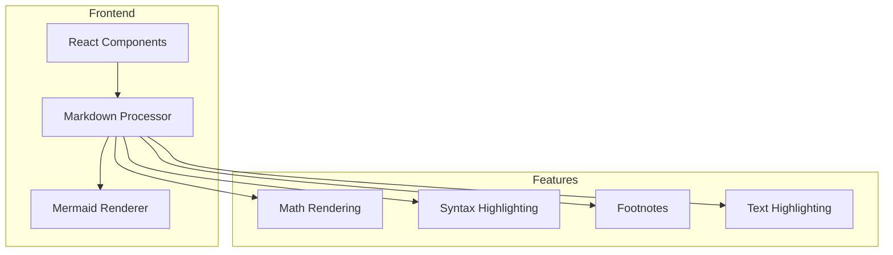
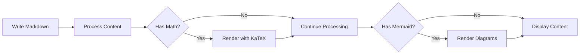
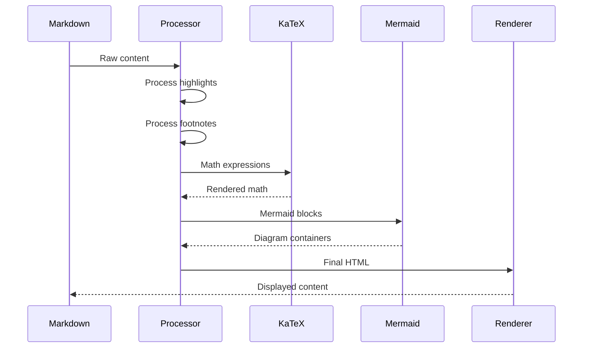

# Complete Features Demo

This document showcases all the advanced markdown features implemented in the portfolio.

## Math Equations with KaTeX

### Inline Math
The quadratic formula is $x = \frac{-b \pm \sqrt{b^2 - 4ac}}{2a}$ and Euler's identity is $e^{i\pi} + 1 = 0$.

### Display Math
$$
\begin{aligned}
\nabla \times \vec{F} &= \left( \frac{\partial F_z}{\partial y} - \frac{\partial F_y}{\partial z} \right) \mathbf{i} \\
&\quad + \left( \frac{\partial F_x}{\partial z} - \frac{\partial F_z}{\partial x} \right) \mathbf{j} \\
&\quad + \left( \frac{\partial F_y}{\partial x} - \frac{\partial F_x}{\partial y} \right) \mathbf{k}
\end{aligned}
$$

Matrix operations:
$$
\begin{pmatrix}
a & b \\
c & d
\end{pmatrix}
\begin{pmatrix}
x \\
y
\end{pmatrix}
=
\begin{pmatrix}
ax + by \\
cx + dy
\end{pmatrix}
$$

## Text Highlighting

You can ==highlight important text== using double equals signs. This is ==particularly useful== for emphasizing key concepts or ==critical information== in your content.

## Footnotes

Here's some text with a footnote[^1] and another one[^2]. You can also use named footnotes[^important-note].

[^1]: This is the first footnote with some detailed explanation.

[^2]: This is the second footnote showing how multiple footnotes work together.

[^important-note]: Named footnotes make it easier to manage references in longer documents.

## Blockquotes

> This is a simple blockquote demonstrating the styling.
> 
> It can span multiple lines and paragraphs.

> ### Blockquote with Header
> 
> Blockquotes can contain other markdown elements:
> 
> - List items
> - **Bold text**
> - *Italic text*
> - `code snippets`
> 
> > Nested blockquotes are also supported
> > and styled appropriately.

## Mermaid Diagrams

### System Architecture


### Development Process


## Code Examples

### JavaScript with Math
```javascript
// Calculate the area of a circle
function circleArea(radius) {
    return Math.PI * Math.pow(radius, 2);
}

// Pythagorean theorem
function hypotenuse(a, b) {
    return Math.sqrt(a*a + b*b);
}
```

### Python with Highlighting
```python
def fibonacci(n):
    """Calculate fibonacci number using dynamic programming"""
    if n <= 1:
        return n
    
    # Using memoization for efficiency
    dp = [0, 1]
    for i in range(2, n + 1):
        dp.append(dp[i-1] + dp[i-2])
    
    return dp[n]

# Example usage
result = fibonacci(10)
print(f"The 10th Fibonacci number is: {result}")
```

## All Features Working Together

This paragraph demonstrates ==multiple features== working together. We have a mathematical formula $f(x) = x^2 + 2x + 1$ with highlighting and a footnote[^combined] explaining the concept.

> **Note**: The combination of features creates a powerful authoring experience:
> 
> - Math equations for technical content: $\int_0^{\infty} e^{-x^2} dx = \frac{\sqrt{\pi}}{2}$
> - ==Highlighted text== for emphasis
> - Footnotes[^workflow] for additional context
> - Diagrams for visual explanations

[^combined]: This footnote demonstrates how all features can work together seamlessly.

[^workflow]: The workflow integrates all these features into a cohesive markdown processing pipeline.

### Feature Interaction Diagram


---

This demo showcases the complete feature set including math rendering, text highlighting, footnotes, blockquotes, mermaid diagrams, and syntax highlighting all working together!
