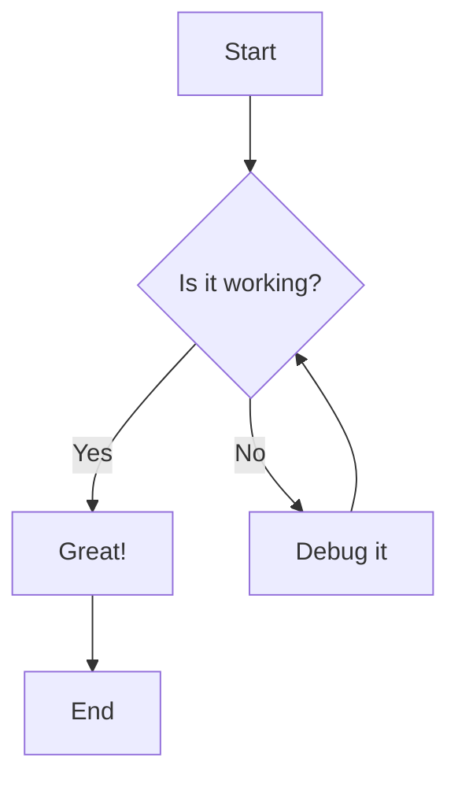
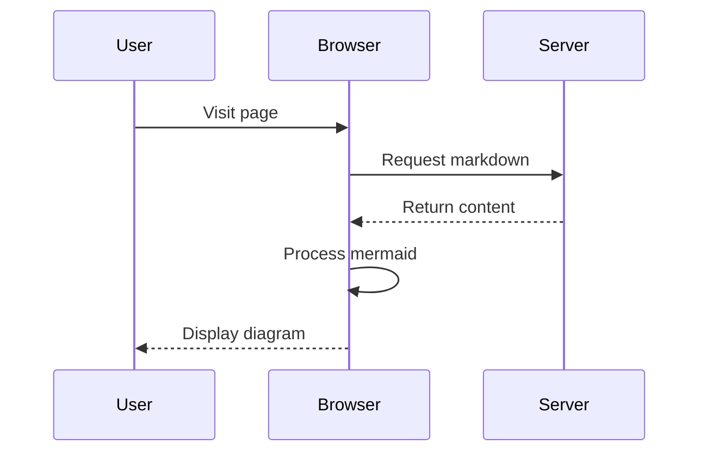
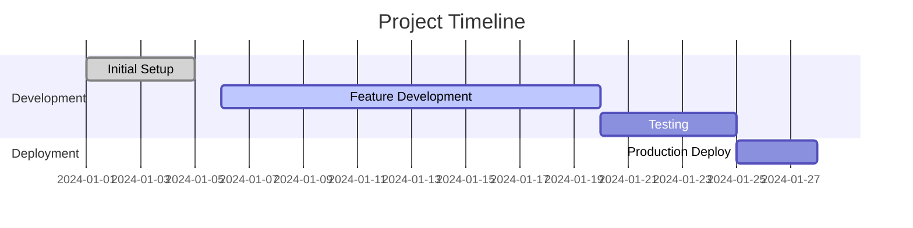
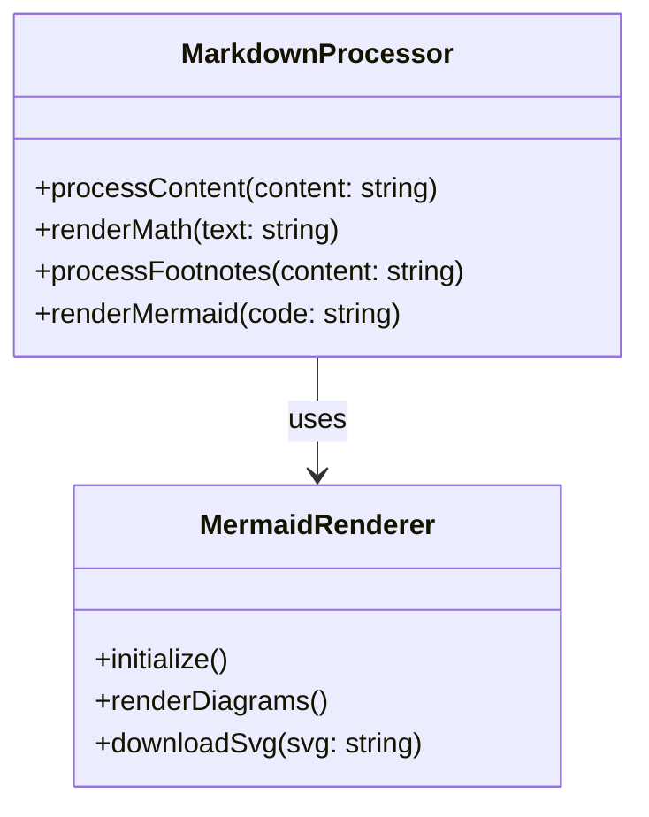

# Mermaid Diagrams Demo

This page demonstrates the Mermaid diagram rendering capabilities.

## Flow Chart



## Sequence Diagram



## Gantt Chart



## Class Diagram



## Git Flow

```mermaid
gitgraph
    commit id: "Initial"
    branch feature
    checkout feature
    commit id: "Add mermaid"
    commit id: "Add styling"
    checkout main
    merge feature
    commit id: "Release v1.0"
```

All diagrams should render properly with download buttons and proper styling!
