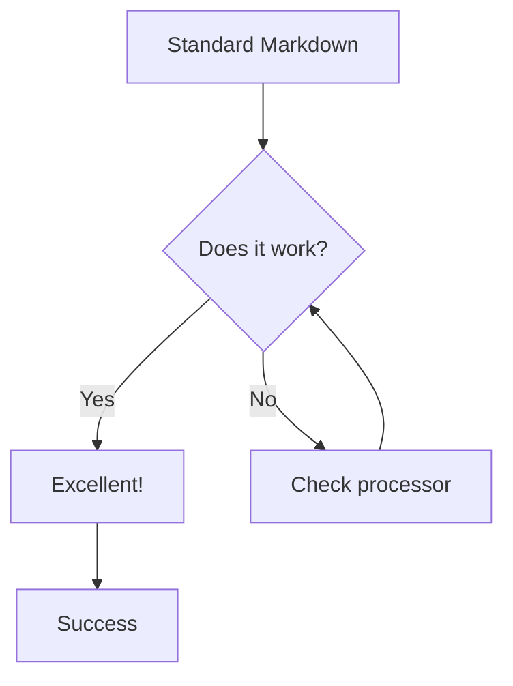
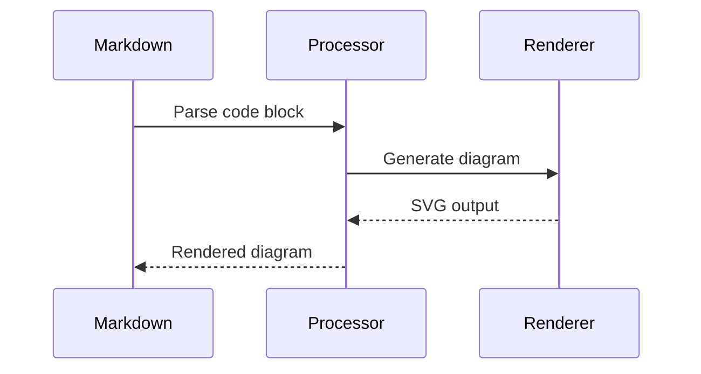
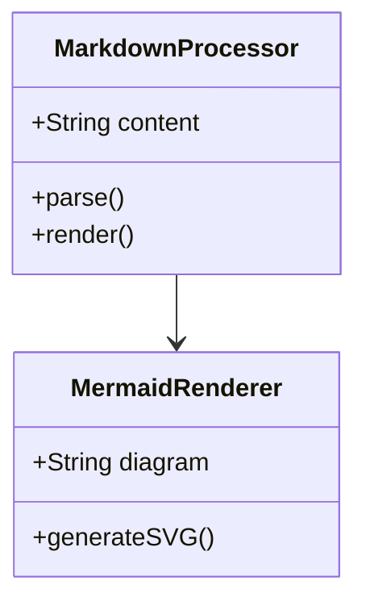
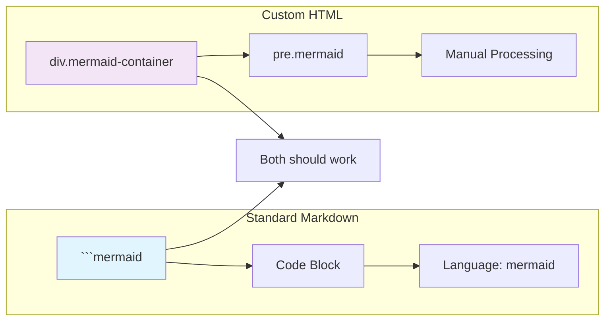

# {{title}}

## Introduction

This page contains comprehensive test cases for Mermaid diagram rendering, including various diagram types, error scenarios, and edge cases to verify proper containment and error handling.

## Valid Diagram Test Cases

### 1. Simple Flowchart

<div class="mermaid-container">
  <div id="flowchart-1" class="mermaid-diagram"></div>
  <div class="mermaid-loading">Loading diagram...</div>
  <pre class="mermaid">
flowchart TD
    A[Start] --> B{Is it working?}
    B -->|Yes| C[Great!]
    B -->|No| D[Debug it]
    D --> B
    C --> E[End]
  </pre>
</div>

### 2. Sequence Diagram

<div class="mermaid-container">
  <div id="sequence-1" class="mermaid-diagram"></div>
  <div class="mermaid-loading">Loading diagram...</div>
  <pre class="mermaid">
sequenceDiagram
    participant A as Alice
    participant B as Bob
    A->>B: Hello Bob, how are you?
    B-->>A: Great!
    A-)B: See you later!
  </pre>
</div>

### 3. Class Diagram

<div class="mermaid-container">
  <div id="class-1" class="mermaid-diagram"></div>
  <div class="mermaid-loading">Loading diagram...</div>
  <pre class="mermaid">
classDiagram
    class Animal {
        +String name
        +int age
        +makeSound()
    }
    class Dog {
        +String breed
        +bark()
    }
    Animal <|-- Dog
  </pre>
</div>

### 4. State Diagram

<div class="mermaid-container">
  <div id="state-1" class="mermaid-diagram"></div>
  <div class="mermaid-loading">Loading diagram...</div>
  <pre class="mermaid">
stateDiagram-v2
    [*] --> Still
    Still --> [*]
    Still --> Moving
    Moving --> Still
    Moving --> Crash
    Crash --> [*]
  </pre>
</div>

### 5. Entity Relationship Diagram

<div class="mermaid-container">
  <div id="er-1" class="mermaid-diagram"></div>
  <div class="mermaid-loading">Loading diagram...</div>
  <pre class="mermaid">
erDiagram
    CUSTOMER ||--o{ ORDER : places
    ORDER ||--|{ LINE-ITEM : contains
    PRODUCT ||--o{ LINE-ITEM : "ordered in"
  </pre>
</div>

### 6. User Journey

<div class="mermaid-container">
  <div id="journey-1" class="mermaid-diagram"></div>
  <div class="mermaid-loading">Loading diagram...</div>
  <pre class="mermaid">
journey
    title My working day
    section Go to work
      Make tea: 5: Me
      Go upstairs: 3: Me
      Do work: 1: Me, Cat
    section Go home
      Go downstairs: 5: Me
      Sit down: 5: Me
  </pre>
</div>

## Error Test Cases

### 7. Syntax Error - Invalid Flowchart

<div class="mermaid-container">
  <div id="error-1" class="mermaid-diagram"></div>
  <div class="mermaid-loading">Loading diagram...</div>
  <pre class="mermaid">
flowchart TD
    A[Start] --> B{Invalid syntax here
    B -->|Yes| C[This should fail]
    Missing closing bracket
  </pre>
</div>

### 8. Syntax Error - Malformed Sequence

<div class="mermaid-container">
  <div id="error-2" class="mermaid-diagram"></div>
  <div class="mermaid-loading">Loading diagram...</div>
  <pre class="mermaid">
sequenceDiagram
    participant A as Alice
    participant B as Bob
    A->>B: Hello Bob
    Invalid arrow syntax here ->->-> B
    B-->>A: This should break
  </pre>
</div>

### 9. Lexical Error - Unknown Diagram Type

<div class="mermaid-container">
  <div id="error-3" class="mermaid-diagram"></div>
  <div class="mermaid-loading">Loading diagram...</div>
  <pre class="mermaid">
unknownDiagramType
    This is not a valid diagram type
    Should produce lexical error
  </pre>
</div>

### 10. Parse Error - Incomplete Class Diagram

<div class="mermaid-container">
  <div id="error-4" class="mermaid-diagram"></div>
  <div class="mermaid-loading">Loading diagram...</div>
  <pre class="mermaid">
classDiagram
    class Animal {
        +String name
        +int age
        Missing closing brace
    class Dog {
        +String breed
  </pre>
</div>

### 11. Empty Diagram

<div class="mermaid-container">
  <div id="error-5" class="mermaid-diagram"></div>
  <div class="mermaid-loading">Loading diagram...</div>
  <pre class="mermaid">
  </pre>
</div>

### 12. Whitespace Only

<div class="mermaid-container">
  <div id="error-6" class="mermaid-diagram"></div>
  <div class="mermaid-loading">Loading diagram...</div>
  <pre class="mermaid">
    
    
  </pre>
</div>

## Complex Valid Diagrams

### 13. Complex Flowchart with Subgraphs

<div class="mermaid-container">
  <div id="complex-1" class="mermaid-diagram"></div>
  <div class="mermaid-loading">Loading diagram...</div>
  <pre class="mermaid">
flowchart TB
    subgraph S1 [Frontend]
        A[React App] --> B[Components]
        B --> C[State Management]
    end
    
    subgraph S2 [Backend]
        D[API Gateway] --> E[Services]
        E --> F[Database]
    end
    
    S1 --> S2
    
    style A fill:#e1f5fe
    style D fill:#f3e5f5
  </pre>
</div>

### 14. Detailed Sequence with Loops

<div class="mermaid-container">
  <div id="complex-2" class="mermaid-diagram"></div>
  <div class="mermaid-loading">Loading diagram...</div>
  <pre class="mermaid">
sequenceDiagram
    participant U as User
    participant C as Client
    participant S as Server
    participant DB as Database
    
    U->>C: Login Request
    C->>S: Authenticate
    S->>DB: Check Credentials
    
    alt successful auth
        DB-->>S: Valid User
        S-->>C: Success Token
        C-->>U: Login Success
    else failed auth
        DB-->>S: Invalid User
        S-->>C: Auth Error
        C-->>U: Login Failed
    end
    
    loop Every 5 minutes
        C->>S: Refresh Token
        S-->>C: New Token
    end
  </pre>
</div>

## Standard Markdown Mermaid Syntax Test Cases

The following test cases use standard Markdown code fences with `mermaid` language identifier to test the built-in Markdown processor handling.

### 15. Standard Flowchart (Markdown Syntax)



### 16. Standard Sequence Diagram (Markdown Syntax)



### 17. Standard Class Diagram (Markdown Syntax)



### 18. Error Case - Standard Markdown Syntax

```mermaid
flowchart TD
    A[Test] --> B{Broken syntax
    This should fail in standard markdown too
    B -->|Error| C[Handle gracefully]
```

### 19. Complex Diagram - Standard Markdown



## Comparison: Markdown vs Custom HTML

| Feature | Standard Markdown | Custom HTML Container |
|---------|-------------------|----------------------|
| Syntax | ```mermaid | `<pre class="mermaid">` |
| Processing | Automatic | Manual JavaScript |
| Error Handling | Depends on processor | Custom error display |
| Download Button | Not included | Custom download functionality |
| DOM Control | Limited | Full control |

## Test Results Summary

The test cases above should demonstrate:

1. **Valid Diagrams**: Proper rendering with download buttons and containment
2. **Error Cases**: Graceful error handling with contained error messages
3. **Complex Diagrams**: Advanced features working correctly
4. **Edge Cases**: Empty and whitespace-only inputs handled properly

## Key Takeaways

- All valid diagrams should render correctly within their containers
- Error messages should be contained and not break page layout
- No "Syntax error in text" artifacts should escape their containers
- Download functionality should work for all valid diagrams
- CSS containment prevents layout breakage

## Expected Behavior

✅ **Working correctly**: Valid diagrams render with download buttons  
✅ **Error containment**: Syntax errors show friendly error messages in containers  
✅ **Layout protection**: No errors escape containers or break page layout  
✅ **Clean DOM**: No leftover `d${id}` elements in the DOM after rendering
